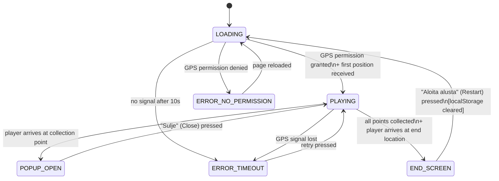
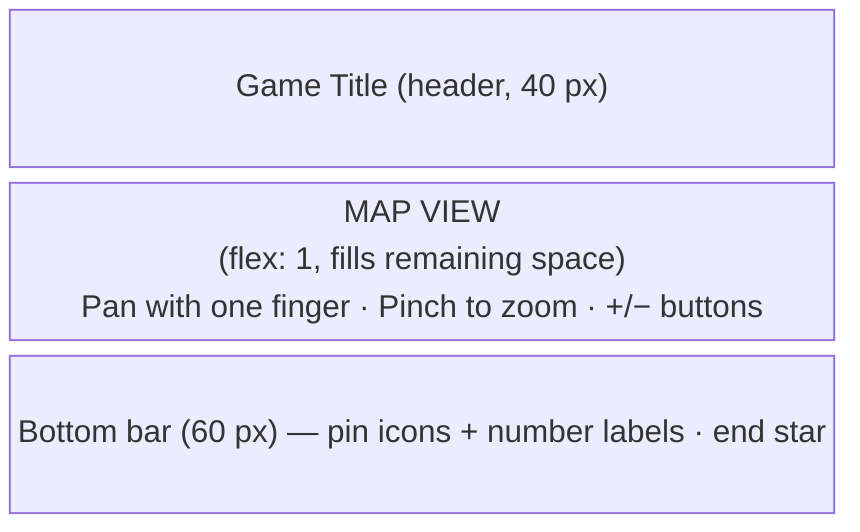
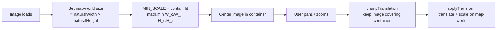

# Location Puzzle Game – Specification (AI Agent Guide)

## Overview

A browser-based mobile game embedded in a WordPress page as a Custom HTML block.
The player physically moves around an area, collects clues from GPS locations, and solves a final puzzle.
Play time: 5–10 minutes. All in-game UI text is in **Finnish**.

**Files:**
- `game.html` – the complete game in a single file (HTML + CSS + JS). Embedded into WordPress.
- `game.gpx` – GPX 1.1 file containing all game content and settings. Served from the web server.
- `kartta.png` – map image served from the web server.

---

## Game State Machine



---

## Game Mechanics

### Phase 1 – Collection (state: PLAYING / POPUP_OPEN)
- The map shows N collection points as **red gradient circles** with a `?` icon and the end location as a **gold circle** with a `★` icon.
- Player position: **blue** filled circle.
- Distance in meters shown below each point label (e.g. "42 m").
- A point is collected when: distance ≤ `geofenceRadius` AND `accuracy ≤ gpsAccuracyLimit`:
  - Point turns **green** with a `✓` icon
  - State transitions: PLAYING → POPUP_OPEN
  - Popup opens automatically
- Popup **does not close automatically** if the player walks away — only closes via the "Close" button.
- Points can be collected **in any order**.
- A previously collected point can have its popup reopened via the bottom bar.

### Phase 2 – End Location (state: PLAYING)
- The end location only activates **after all collection points have been collected**.
- If the player arrives at the end location before collecting all points → show toast: *"Kerää ensin kaikki pisteet ({collected}/{total}"* ("Collect all points first").
- When all points are collected and player arrives at end location → state: PLAYING → END_SCREEN.
- The end location **may share the same coordinates** as a collection point or the starting position — the logic works correctly either way.

### Phase 3 – Puzzle (state: END_SCREEN)
- Collected letters are displayed **sorted by location `id`** (id 1, 2, 3...) regardless of collection order.
- Answer checking: if `checkAnswer: true`, compare input against `puzzle.answer` **case-insensitively** and **trimming whitespace**.
- If `checkAnswer: false`, the "Check answer" button is not shown.

---

## User Interface

### Layout (portrait, mobile)



### Start Screen (state: LOADING)
- Game title (from GPX `<name>`)
- Short instruction (Finnish): *"Siirry pisteisiin kartalla ja kerää vihjeet. Lopuksi palaa loppupisteeseen ratkaisemaan arvoitus."*
- "Aloita peli" button → requests GPS permission
- If GPS permission denied → error message: *"Sijaintilupa vaaditaan pelin pelaamiseen. Salli sijainti selaimen asetuksista ja lataa sivu uudelleen."*

### Map View (state: PLAYING / POPUP_OPEN)
- Map image displayed at its **natural pixel dimensions** — no cropping.
- Initial zoom set so the **full map fits the screen** (contain-style fit), centered.
- User can **pan** (one finger / mouse drag) and **zoom** (pinch / scroll wheel / +− buttons).
- Points are rendered using absolutely positioned `<div>` elements overlaid on the map.

**Marker styles:**

| Marker | State | Appearance |
|---|---|---|
| Collection point | Not collected | Red gradient circle, `?` icon, pulsing glow animation |
| Collection point | Collected | Green gradient circle, `✓` icon |
| End location | Inactive (not all collected) | Muted grey circle, `★` icon, dimmed |
| End location | Active (all collected) | Gold gradient circle, `★` icon, pulsing glow animation |
| Player | Good accuracy | Blue pulsing circle |
| Player | Weak accuracy | Grey circle |

- **GPS accuracy warning**: if `accuracy > gpsAccuracyLimit`, player circle is grey and a banner appears: *"GPS-signaali heikko, odota..."*

### Off-Screen Points
If a point's calculated pixel coordinate falls outside the map image area:
1. Calculate direction from map center to point
2. Intersect the direction line with the map boundary
3. Render a small colored dot clamped to the map edge (10 px inset)

### Bottom Bar
- Fixed, 60 px tall, full width
- Each collection point: small gradient circle (red `?` = not collected, green `✓` = collected) + number label
- End location: circle icon (grey `★` = not yet active, gold `★` = active)
- Tapping a **collected** point → reopens its popup (state PLAYING → POPUP_OPEN)
- Tapping a **not-yet-collected** point → no action

### Popup Window (state: POPUP_OPEN)
- Modal overlay on top of the map with darkened backdrop
- Contents:
  - Point name (heading)
  - Hint text in Finnish (`hint`)
  - Collected letter displayed large (48 px, highlighted)
- "Sulje" (Close) button → state POPUP_OPEN → PLAYING

### GPS Error States
| Situation | Finnish message shown | Action |
|---|---|---|
| Permission denied | "Sijaintilupa vaaditaan..." | Instructions to browser settings, no auto-retry |
| Timeout 10 s | "Ei GPS-signaalia. Siirry ulos." | Retry button |
| `accuracy > gpsAccuracyLimit` | "GPS-signaali heikko, odota..." | Warning banner, game continues |

### End Screen (state: END_SCREEN)
- Game title heading
- `endLocation.text` displayed
- Collected letters in a grid, sorted by `id` (1→N): large letter + point name below each
- `puzzle.instruction` text
- Text input for answer
- "Tarkista vastaus" button (only if `checkAnswer: true`)
  - Correct → green message: *"Oikein! Hyvin pelattu!"*
  - Wrong → red message: *"Ei oikein, yritä uudelleen."*
- "Aloita alusta" button → clears localStorage, reloads page

---

## Technical Implementation

### File Structure
```
game.html    ← full game (WordPress Custom HTML block)
game.gpx     ← all game content and settings (served from web server root)
kartta.png   ← map image (served from web server root)
```

### Technology
- Vanilla HTML + CSS + JavaScript — **no external libraries**
- `navigator.geolocation.watchPosition()` for continuous tracking, options: `{ timeout: 10000, enableHighAccuracy: true }`
- `DOMParser` for parsing GPX XML (native browser API)
- Haversine formula for GPS distance calculations
- Web Mercator (`latToMerc` / `mercToLat`) for Y-axis coordinate conversion
- `localStorage` key `location_puzzle_state` for persisting game state
- No backend, no cookies, no external API calls

### localStorage Schema
```javascript
// Key: "location_puzzle_state"
{
  "collected": [1, 3],    // array of collected location ids
  "endReached": false     // whether the end location has been reached
}
```
The game reads this on startup and resumes from where the player left off.

### Configuration: Minimal JS CONFIG

```javascript
const CONFIG = {
  // Load GPX from URL (used in production)
  gpxUrl: "https://kempeleenlatu.fi/game.gpx",

  // OR embed GPX directly for a fully self-contained single file:
  // gpxInline: `<?xml version="1.0" encoding="UTF-8"?><gpx>...</gpx>`,

  debug: false,  // true = simulate GPS by clicking/tapping the map
};
```

If `gpxInline` is set it takes precedence over `gpxUrl`.

### Configuration: GPX File Format

```xml
<?xml version="1.0" encoding="UTF-8"?>
<gpx version="1.1" creator="Paikannusarvoitus"
     xmlns="http://www.topografix.com/GPX/1/1"
     xmlns:game="https://kempeleenlatu.fi/gpx-game">

  <metadata>
    <name>Game title</name>
    <bounds minlat="64.896895" minlon="25.513276"
            maxlat="64.909018" maxlon="25.544147"/>
    <extensions>
      <game:mapImage>https://kempeleenlatu.fi/kartta.png</game:mapImage>
      <game:geofenceRadius>15</game:geofenceRadius>
      <game:gpsAccuracyLimit>30</game:gpsAccuracyLimit>
      <game:checkAnswer>true</game:checkAnswer>
      <game:puzzleInstruction>Finnish puzzle instruction.</game:puzzleInstruction>
      <game:puzzleAnswer>KOTI</game:puzzleAnswer>
    </extensions>
  </metadata>

  <!-- End location: activated only after all collect points visited -->
  <wpt lat="64.900809" lon="25.527019">
    <name>Pääskyläntie 2</name>
    <type>end</type>
    <desc>Text shown on the end screen.</desc>
  </wpt>

  <!-- Collection points: id determines letter order on end screen -->
  <wpt lat="64.905434" lon="25.520382">
    <name>Koskela</name>
    <type>collect</type>
    <extensions>
      <game:id>1</game:id>
      <game:letter>K</game:letter>
      <game:hint>Finnish hint text shown in popup.</game:hint>
    </extensions>
  </wpt>
  <!-- repeat for each collection point -->
</gpx>
```

**GPX field reference:**

| Field | Where | Description |
|---|---|---|
| `<name>` | metadata | Game title |
| `<bounds>` | metadata | Map image corners (standard GPX) — NW = maxlat+minlon, SE = minlat+maxlon |
| `game:mapImage` | metadata/extensions | URL of the map image |
| `game:geofenceRadius` | metadata/extensions | Metres — how close player must get |
| `game:gpsAccuracyLimit` | metadata/extensions | Metres — reject positions less accurate than this |
| `game:checkAnswer` | metadata/extensions | `true` / `false` |
| `game:puzzleInstruction` | metadata/extensions | Finnish instruction text on end screen |
| `game:puzzleAnswer` | metadata/extensions | Correct answer (case-insensitive comparison) |
| `<wpt type="end">` | waypoint | End location |
| `<wpt type="collect">` | waypoint | Collection point |
| `game:id` | wpt/extensions | Integer — sort order for letters on end screen |
| `game:letter` | wpt/extensions | Single letter collected at this point |
| `game:hint` | wpt/extensions | Finnish hint shown in popup |

### GPS to Pixel Coordinate Conversion

The map image is displayed at its **natural pixel dimensions**. Coordinates map directly to image pixels.

```javascript
function latToMerc(lat) {
  const r = lat * Math.PI / 180;
  return Math.log(Math.tan(Math.PI / 4 + r / 2));
}

function gpsToPixel(lat, lon) {
  const b   = gameConfig.mapBounds;
  const img = document.getElementById('map-image');
  const W_i = img.naturalWidth;
  const H_i = img.naturalHeight;

  const relX = (lon - b.topLeft.lon) / (b.bottomRight.lon - b.topLeft.lon);
  const mY   = latToMerc(lat);
  const mTop = latToMerc(b.topLeft.lat);
  const mBot = latToMerc(b.bottomRight.lat);
  const relY = (mTop - mY) / (mTop - mBot);  // Web Mercator Y (inverted)

  return { x: relX * W_i, y: relY * H_i };
}
```

`mapBounds.topLeft` = NW corner (maxlat, minlon from GPX `<bounds>`).
`mapBounds.bottomRight` = SE corner (minlat, maxlon from GPX `<bounds>`).

**Note:** Web Mercator is used for Y-axis because OpenStreetMap tiles are Mercator-projected. Linear latitude interpolation causes systematic position errors at high latitudes (65°N).

### Pan / Zoom System



- Initial zoom: full map visible (contain fit), centered.
- `MIN_SCALE` = computed from image and container size after image loads.
- `MAX_SCALE` = 6.
- Panning clamped so the image always covers the container — no empty space visible.
- Touch events attached to `map-world` (not `map-container`) so zoom +/− buttons remain tappable.

### Debug Mode
When `debug: true` in CONFIG:
- GPS position simulated by tapping anywhere on the map (no real GPS required)
- Geofence radius visualized as a dashed circle around each point
- Current GPS coordinates and accuracy shown at top of map

### WordPress Embedding
Copy the entire `game.html` content into a WordPress **Custom HTML** block. Upload `game.gpx` and `kartta.png` to the server (web root or any URL reachable by the game). The page must be served over HTTPS.

### Mobile Optimisation
- `<meta name="viewport" content="width=device-width, initial-scale=1, user-scalable=no">`
- `touch-action: none` on `#map-container` — prevents browser scroll from intercepting map touch events
- Touch events on `map-world` with `{ passive: false }` + `e.preventDefault()` for pan/pinch
- All interactive elements minimum 44×44 px touch target
- `touch-action: manipulation` on buttons to prevent double-tap zoom delay

---

## Constraints

- GPS permission is mandatory — the game cannot function without it
- GPS is only reliable outdoors
- HTTPS is required — `geolocation` does not work over HTTP
- `game.gpx` must be on the same origin as the page, or served with `Access-Control-Allow-Origin: *`
- Progress is stored in `localStorage` — lost if the user clears browser data
- WordPress may strip `<script>` tags depending on theme/plugins — always test on the live site

---

## Resolved Decisions

- [x] Configuration: GPX 1.1 file with custom `game:` namespace extensions
- [x] Number of points: determined by puzzle word length (`<wpt type="collect">` count)
- [x] Geofence radius: 15 m, configurable in GPX
- [x] GPS accuracy limit: reject positions worse than 30 m, configurable in GPX
- [x] GPS error states: three cases, each with Finnish message
- [x] Coordinate conversion: Web Mercator Y-axis, natural image pixel dimensions
- [x] Map display: natural image size, no object-fit cropping, pan+zoom system
- [x] Map pan/zoom: one-finger pan, pinch zoom, scroll wheel, +/− buttons
- [x] Debug mode: GPS simulation by tapping map + geofence circles visible
- [x] Popup: does not auto-close
- [x] Bottom bar: 60 px fixed, gradient circle icons matching map markers
- [x] Off-screen points: clamped to map edge as small colored dot
- [x] Letter order on end screen: sorted by `id` (not collection order)
- [x] End location: only activates after all points collected; may share coords with start
- [x] localStorage: key and schema defined
- [x] Reset: "Aloita alusta" clears localStorage and reloads; also available mid-game via ↺ button
- [x] Game title: from GPX `<metadata><name>`
- [x] Answer checking: case-insensitive, whitespace trimmed
- [x] Mid-game restart: ↺ button in header available at all times during PLAYING state
